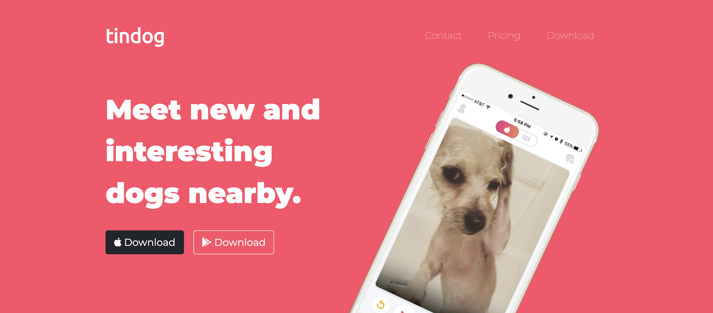
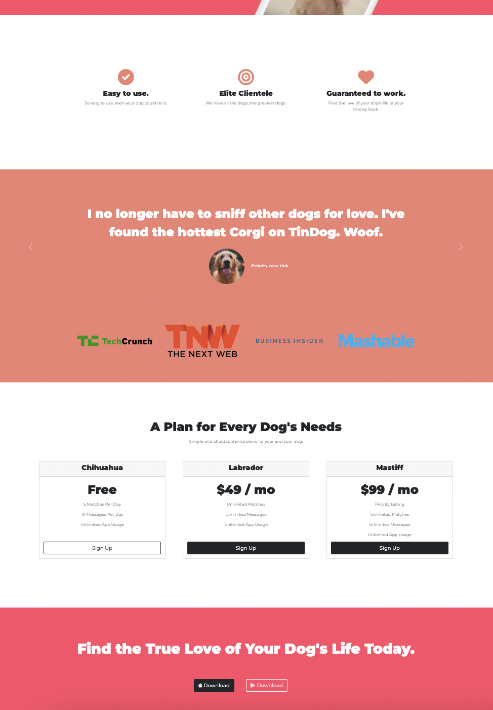

# 🐶 TinDog Website
&nbsp;&nbsp;&nbsp;&nbsp; It is a landing-page/website that advertises a fictional app called **TinDog** which is exclusively for: "matching dogs with each other", similar to tinder app for humans.

## About TinDog
The home page website provides details about the application to the user including:   
- the title with navbar, catchphrase and download buttons  
- a few features showing why you should download the app  
- a section that displays feedback from clients  
- pricing for different plans/subscriptions  
- a final call with catchphrase and download buttons  
- ends with social media handles + copyright mark

## Deployment

Check out the TinDog website here --> Demo: [TinDog WebSite](https://rahuls1428.github.io/myTinDog/)

## Tools Used

This website uses basic HTML5 and CSS3 along with Bootstrap 5. Boostrap is a popular front-end framework for building responsive (mobile-first) websites.
Using bootstrap helped in organizing our code as well as having readily available components at our fingertips to add to our website. The bootstrap components used for this project include:  
1. Navbar 
2. Buttons
3. Bootstrap Grid System
4. Carousel
5. Card

The website also uses Google Fonts (for styling text) and Font Awesome (for icons) and icons8 (for the favicon).

## Authors

  * **Rahul Solaiappan**

## Acknowledgement
The website was developed with help from Angela Yu's course on Udemy called "The Complete Web Development Bootcamp".

